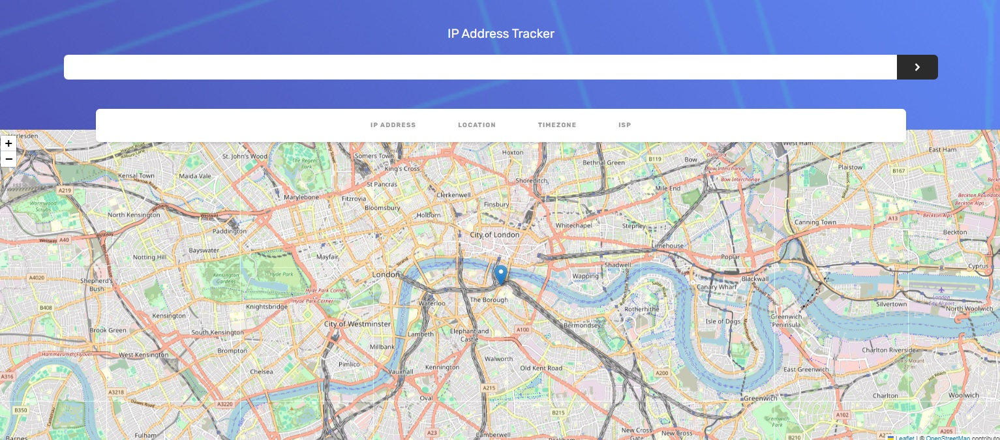

IP Address Tracker

This is a responsive React application that tracks the geolocation of an IP address and displays the location on a map. The application uses the IP-API service to fetch geolocation data and Leaflet for the map display. It is designed to be responsive for screen widths of 375px (mobile devices) and 1440px (desktop).
Features

    Search for an IP address to get its geolocation data.
    Display the IP address, location (country and city), timezone, and ISP.
    Show the location on an interactive map.
    Automatically recenter the map when a new location is fetched.
    Responsive design for 375px and 1440px screen widths.

Live Demo

Check out the live demo of the application on Vercel: https://vercel.com/amir-shariats-projects-d1218d86/ip-address-tracker

IP Address Tracker on Vercel

Dependencies

    React
    Axios
    Leaflet
    react-leaflet
    Tailwind CSS

Configuration

Make sure you have Tailwind CSS configured in your project. You can install and configure Tailwind CSS by following the Tailwind CSS installation guide.
API

This application uses the IP-API service to fetch geolocation data. No API key is required for this service.
Responsiveness

The application is designed to be responsive and works well on both mobile devices and desktops:

    Mobile devices: Optimized for a screen width of 375px.
    Desktops: Optimized for a screen width of 1440px.

